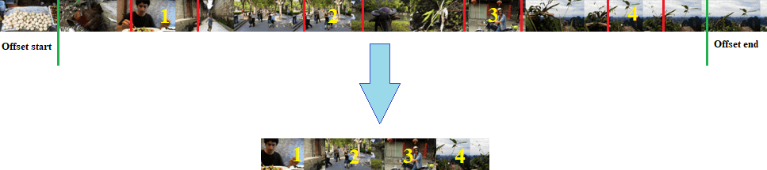

# SadBoys
### Overview
This is a fun project done in [Python](https://www.python.org/). The goal of this project is to compile nostalgic/sad type of videos from the video and music inputs that the User chooses. The ideal output would be something like [this video](https://www.youtube.com/watch?v=cFpekJ5h1XY&list=RDC02WOL9lLx8&index=4) or [this one](https://www.youtube.com/watch?v=M9Y2p5l6IWU&list=RDC02WOL9lLx8&index=36). There are quite a lot of videos like that on YouTube and apparently they are quite popular having millions of views :smiley: The project was very much inspired by the following YouTube [video](https://www.youtube.com/watch?v=EmZX9fgHoYk).
Now I am not saying that I'm a sad person, I simply found the idea quite entertaining and wanted to try coding the program myself using Python and explore a little bit of its capabilities as well as get familiar with Visual Studio Code IDE :smiley:

### Program execution flow
For the input original video path, offsets from the beginning and the end (in case the video contains start or end credits), desired final video length and the desired min/max durations of the video chunks, the program takes uniformly distributed cuts (subclips) from the video and stitches them together in one final video clip (there is also an option to shuffle the subclips):



Then after all the subclips are stitched together, the program uses the overlay background image and video to mix them ot top of the sequence. The chosen music is also replacing the original soundrack of the video. Additionally, at the beginning of the video we add randomly selected word from the list of predefined words to be used (after the word is being selected, it's being modified so that there are spaces between the letters).

Here is an example of what the input might look like and the produced output:

      

### Installation/Setup
Components needed for the project to work:
1) MoviePy -> can be installed by using the folloiwng command:

    ```sh 
    pip install moviepy
    ```
    
2) [ImageMagick](https://imagemagick.org/)
3) _Optional_
Potentially you would need to configure Python to point to the proper ImageMagick .exe location. The config file to do this should be located in the following folder:
    ```{PathToPythonOnYourComputer}\Lib\site-packages\moviepy\config_defaults.py```
    
    In that file you would need to replace the path in the following line with the path on your computer:
    ```IMAGEMAGICK_BINARY = os.getenv('IMAGEMAGICK_BINARY', 'C:\\Program Files\\ImageMagick-7.0.10-Q16-HDRI\\magick.exe')```

### Project components
The ```root``` folder contains the main executable script __SadBoysCompiler__ that has all code of the project.
The ```assets``` folder include folders that contain files as follows:

- ```music``` -> folder contains music files that are going to be used as a soundtrack for the final compiled video
- ```overlayPics``` -> folder contains different pictures that are going te be used as an overlay background color theme of the final video
- ```overlayVids``` -> folder contains different short clips that are going to be used as an overlay background video theme for the final compiled video
- ```overlayWords``` -> this folder contains a file-array of words one of which is going to be used for the intro section of the compiled video
- ```vids``` -> folder contains video files that are going to be used for the final compiled video

The ```output``` folder contains compiled video examples of the program execution (as of right now these are just first program iteration passes :smiley:). If User chose to do so then the subsequent compiled videos would go into the same folder (or they could choose another one).

### SadBoysCompiler code components
```Sequence``` class -> this is a bulding block class that provides the information about the time in the original video where this subclip begins and where it ends
```InputAgent``` class -> responsible for gathering all User input about original video file, music, overlay image/video, etc.
```SequenceManager``` class -> responsible for generation of the collection (either shuffled or not) of ```Sequence``` class objects based on the original length of the video plus User inputs about desired total length, length of a single subclip, etc.
```WordsGenerator``` class -> responsible for producing the word that is going to be used in the beginning of the final composed video clip
```VideoCreator``` class -> responsible for doing the final video compilation using output of the ```SequenceManager```, User selected music, original video, overlay video and background image

### Lessons learned (so far)
Working on this project allowed me to code in Python using external video processing library, explore its capabilities and have a glimpse of what it has to offer. In addition to that I also used Visual Studio Code IDE and got familiar with it as well as explored how to use different extensions for it and debug a Python program.

### Future improvements
While working on this project I came up with a few ideas that I could explore. Some of them are small, others would require some more time, and some of them are probably too ambitious :laughing:
1) Multiple overlay backgrounds and images could be used for the same video. The program could also be selecting those automatically in a random matter, so that the User won't have to provide those inputs. Offsets could be also selected automatically - for that I would imagine we needed to run some kind of video analysis (ML?) process to determine where the actual video content starts/ends. Subclip lengths could be also automatically picked
2) It is possible to scrape YouTube for the same type of videos that were mentioned in the beginning of this readme file, download automatically and use those videos as an input to the program. In a similar way it is possible to scrape YouTube or any other platform for a "sad" type of free music and to also use that as our final soundrack. The above would allow us to further automate the program and potentially even eliminate User input completely
3) If the above is achieved we could setup this whole program to run once in a while and produce these videos automatically, after that we could upload these videos to a different platform like YouTube, Instagram, TikTok, etc. (could be done manually, not quite sure if possible to automate the upload process, I believe Instagram at the moment doesn't have open API to actually upload videos) and have our own little "channel" with generated content
4) If we scrapes the videos and music we could still potentially use some kind of ML algorithm to then further analyze what we got to see if the video/music are actually what we want. So in this case scraping the Internet based on tags would be just an initial data set and then ML algorightm would be utilized to narrow down the results and improve quality of our inputs